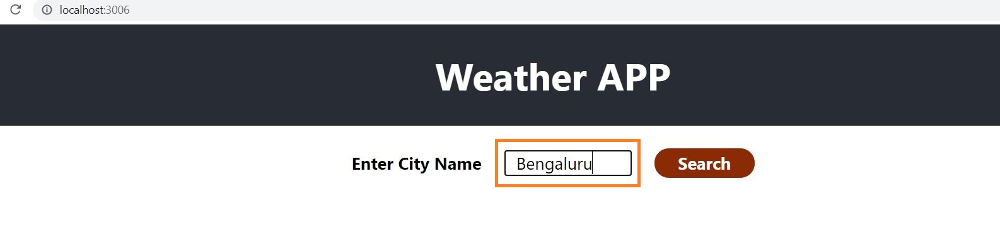
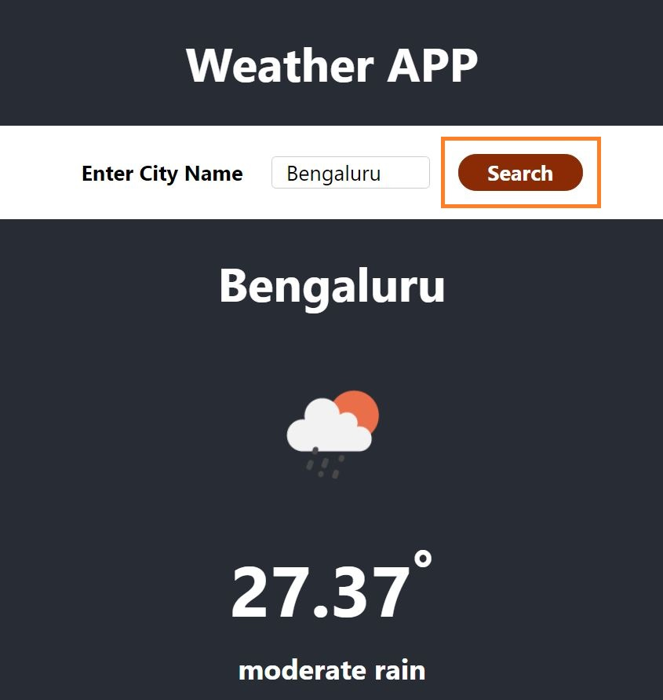

# Weather APP

This is a smiple Weather APP which will allow user to enter City name and show current weather status.

There are 2 parts of this app, one is Frontend Code which is written in React and other one is Backend code which is written in Nodejs.

## Links
### [Frontend Code](https://github.com/RahulChinta/whether-app)
### [Backend Code](https://github.com/RahulChinta/WeatherProjectNodejs)
 

## Setup

### Frontend Code

`npm install` 
`npm start`  

### Backend Code

`npm install` 
`nodemon app.js`  

## Usage

## 1. Enter City Name   

## 2. Click on Search button   
